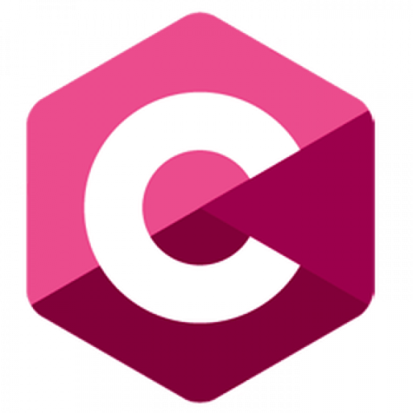
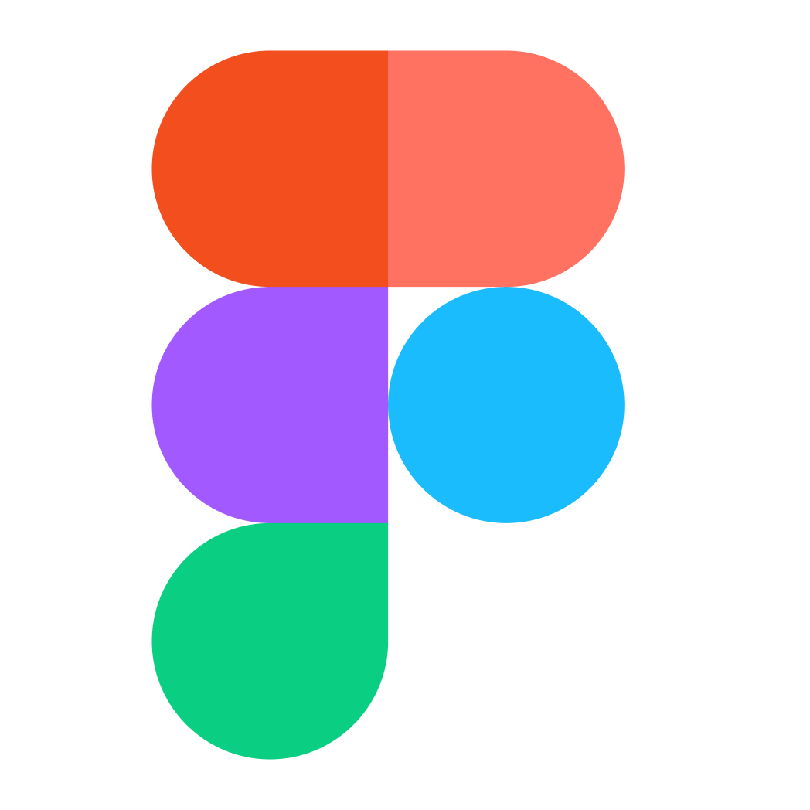
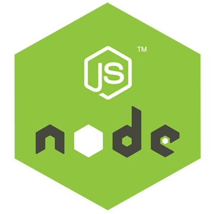
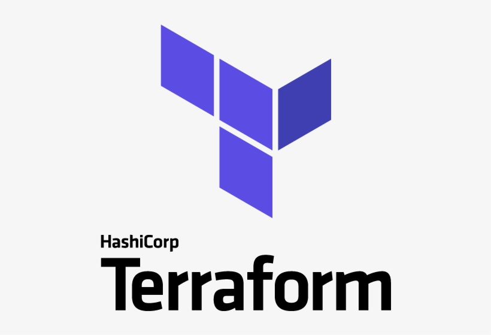
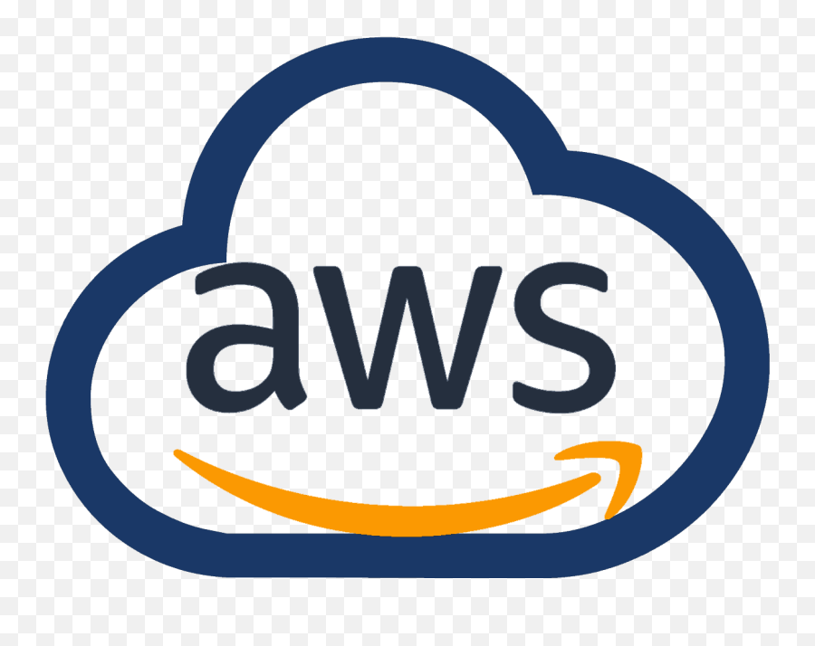
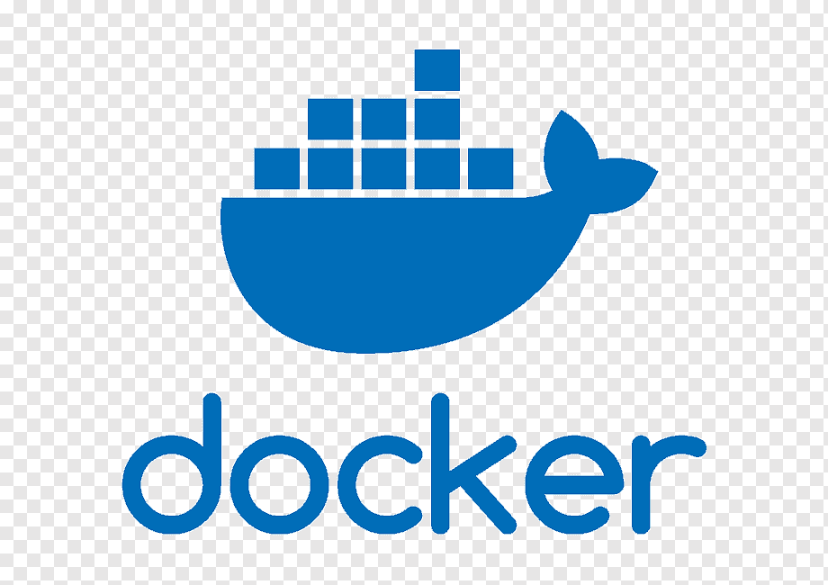
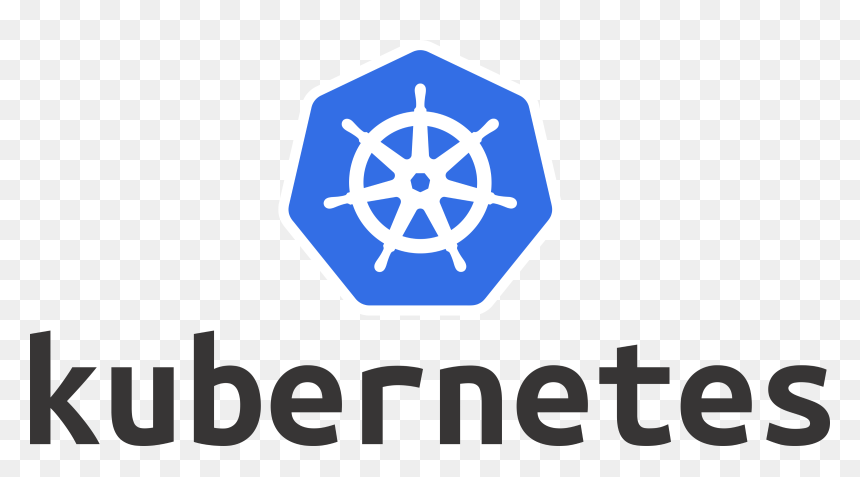

### Hey 👋🏽, I'm Ayush Agarwal <a href="https://www.linkedin.com/in/ayush-ag01/"> 📫 [LinkedIn](https://www.linkedin.com/in/ayush-ag01)

I’m Ayush Agarwal, a **Software Developer** based in India, currently working as a **Senior Full Stack Engineer** at [@Tramés](https://www.linkedin.com/company/trames-pte-ltd/) (remotely), where I build scalable, data-intensive systems for supply-chain visibility — spanning distributed data pipelines, high-performance APIs, and real-time, map-based user interfaces. With a diverse background as a former **Advanced Application Analyst** at [@Accenture](https://www.linkedin.com/company/accentureindia/) and **Full Stack Engineer** at [@UpcloudTechnology](https://www.linkedin.com/company/upcloud-technology/), I bring extensive experience across **Web & App development**, **DevOps**, and **Cloud** technologies.

I like owning problems end-to-end — designing the architecture, shipping the code, and tuning it for scale and reliability. Looking forward to collaborating and learning something new every day!

  
**Talking about Personal Stuffs:**

- 👨🏽‍💻 I’m currently working on event-driven microservices, high-performance APIs, and real-time data visualization at scale;
- 🌱 I’m currently learning Generative AI and applying LLMs to production data pipelines;
- 👯 I’m looking to collaborate on Web & App Development, Distributed Systems, and Cloud projects 🤝;
- 💬 Ask me about anything, I am happy to help;
- ⚡️ Fun Fact: What would life be if we had no courage to attempt anything?
- 📫 How to reach me: ayush.ag.workspace@gmail.com;
- 📝 Find out more about me: [Resume](https://docs.google.com/document/d/1rIxAw9vv1ABOefcBVsfyvpPd1DiwN6_xgyNYuBPexLI/edit?usp=sharing)

**Languages and Tools:**

<code></code>
<code></code>
<code></code>
<code></code>
<code></code>
<code></code>
<code></code>
<code></code>
<code></code>
<code></code>
<code></code>
<code></code>
<code></code>
<code></code>
<code></code>
<code></code>
<code></code>
<code></code>
<code></code>
<code></code>
<code></code>
<code></code>
<code></code>
<code></code>

